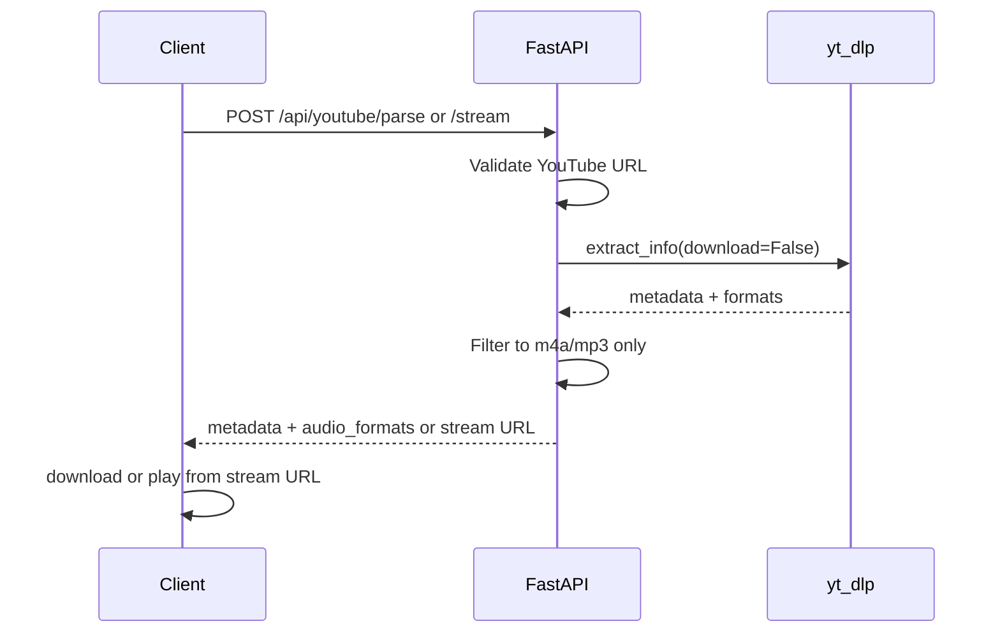

# Music Player Backend

FastAPI backend that parses YouTube URLs with [yt-dlp](https://github.com/yt-dlp/yt-dlp) and returns metadata plus direct audio stream URLs. The server does **not** download or store audio files — the client downloads or streams from the returned URLs.

## Requirements

- Python 3.10+
- Virtual environment (recommended)

Optional but recommended for reliable YouTube extraction:

```bash
pip install "yt-dlp[default]"
```

Some YouTube videos also need a JavaScript runtime such as [deno](https://deno.land).

## Setup

```bash
python3 -m venv venv
source venv/bin/activate   # Windows: venv\Scripts\activate
pip install -r requirements.txt
```

> **Note:** Use `pip install -r requirements.txt` (with `-r`). Without `-r`, pip tries to install a package named `requirements.txt` and will fail.

If pip inside the venv is broken (`ModuleNotFoundError: No module named 'pip._internal...'`), recreate the venv:

```bash
rm -rf venv
python3 -m venv venv
source venv/bin/activate
python -m pip install --upgrade pip
pip install -r requirements.txt
```

## Run the server

Local development:

```bash
uvicorn main:app --reload
```

Access from another device on the same network (phone, tablet, etc.):

```bash
uvicorn main:app --host 0.0.0.0 --port 8000
```

Then use your machine's LAN IP instead of `localhost`, e.g. `http://192.168.1.15:8000`.

- API: `http://127.0.0.1:8000`
- Swagger UI: `http://127.0.0.1:8000/docs`

### Logging

Application logs go to stdout with this format:

```
2026-06-10 14:00:00 | INFO | routers.youtube | Parse request received: url=...
```

Set log verbosity with the `LOG_LEVEL` environment variable (default: `INFO`):

```bash
LOG_LEVEL=DEBUG uvicorn main:app --host 0.0.0.0 --port 8000
```

## API

### Health check

```http
GET /
```

Response:

```json
{ "status": "ok" }
```

### Parse YouTube URL

Returns full metadata plus up to 5 mobile-compatible audio stream options.

```http
POST /api/youtube/parse
Content-Type: application/json
```

Request body:

```json
{
  "url": "https://youtu.be/Hc-rc1-hcco"
}
```

Supported URL forms:

- `https://www.youtube.com/watch?v=...`
- `https://youtu.be/...`
- `https://music.youtube.com/watch?v=...`
- YouTube Shorts URLs

Only YouTube URLs are accepted. Local paths (`file://...`) and other sites are rejected with `400`.

Response (200):

```json
{
  "id": "Hc-rc1-hcco",
  "title": "Sauda Iss Dil Ka (From \"Sharma Ji Ki Shaadi\")",
  "uploader": "Shikhar Saxena",
  "channel": "Shikhar Saxena",
  "duration": 207.0,
  "thumbnail": "https://i.ytimg.com/vi/Hc-rc1-hcco/maxresdefault.jpg",
  "webpage_url": "https://www.youtube.com/watch?v=Hc-rc1-hcco",
  "recommended_format_id": "140",
  "audio_formats": [
    {
      "format_id": "140",
      "ext": "m4a",
      "url": "https://...",
      "abr": 129.609,
      "filesize": 3361234,
      "filesize_approx": 3361200,
      "acodec": "mp4a.40.2",
      "protocol": "https",
      "http_headers": {
        "User-Agent": "...",
        "Accept": "...",
        "Accept-Language": "..."
      }
    }
  ],
  "artist": "Shikhar Saxena",
  "artists": ["Shikhar Saxena"],
  "album": "Sauda Iss Dil Ka (From \"Sharma Ji Ki Shaadi\")",
  "track": "Sauda Iss Dil Ka (From \"Sharma Ji Ki Shaadi\")",
  "categories": ["Music"],
  "tags": ["Shikhar Saxena", "Sauda Iss Dil Ka (From \"Sharma Ji Ki Shaadi\")"],
  "genres": [],
  "description": "Provided to YouTube by Voila Digi Private Limited...",
  "upload_date": "20240814",
  "release_date": "20240814",
  "release_year": 2024,
  "view_count": 176795,
  "like_count": 2801,
  "comment_count": 2,
  "channel_id": "UC22JFmY2iFixvKJ9KynZ1EA",
  "channel_url": "https://www.youtube.com/channel/UC22JFmY2iFixvKJ9KynZ1EA",
  "channel_follower_count": 1670,
  "channel_is_verified": true,
  "uploader_id": null,
  "uploader_url": null,
  "creator": "Shikhar Saxena",
  "creators": ["Shikhar Saxena"],
  "availability": "public",
  "is_live": false,
  "live_status": "not_live",
  "language": null,
  "age_limit": 0
}
```

#### Response fields

| Field                    | Type            | Description                                                          |
| ------------------------ | --------------- | -------------------------------------------------------------------- |
| `id`                     | string          | YouTube video ID                                                     |
| `title`                  | string          | Video title                                                          |
| `uploader`               | string \| null  | Uploader display name                                                |
| `channel`                | string \| null  | Channel name                                                         |
| `duration`               | number \| null  | Length in seconds                                                    |
| `thumbnail`              | string \| null  | Best available thumbnail URL                                         |
| `webpage_url`            | string          | Canonical YouTube watch URL                                          |
| `recommended_format_id`  | string          | Highest-bitrate mobile-compatible audio format ID                    |
| `audio_formats`          | array           | Up to 5 mobile-compatible streams, sorted by bitrate (highest first) |
| `artist`                 | string \| null  | Primary artist (common on music uploads)                             |
| `artists`                | string[]        | All artists                                                          |
| `album`                  | string \| null  | Album name                                                           |
| `track`                  | string \| null  | Track title                                                          |
| `categories`             | string[]        | YouTube categories (e.g. `["Music"]`)                                |
| `tags`                   | string[]        | Video tags                                                           |
| `genres`                 | string[]        | Genre labels when provided by YouTube (often empty)                  |
| `description`            | string \| null  | Full video description                                               |
| `upload_date`            | string \| null  | Upload date (`YYYYMMDD`, UTC)                                        |
| `release_date`           | string \| null  | Release date (`YYYYMMDD`)                                            |
| `release_year`           | number \| null  | Release year                                                         |
| `view_count`             | number \| null  | View count                                                           |
| `like_count`             | number \| null  | Like count                                                           |
| `comment_count`          | number \| null  | Comment count                                                        |
| `channel_id`             | string \| null  | Channel ID                                                           |
| `channel_url`            | string \| null  | Channel URL                                                          |
| `channel_follower_count` | number \| null  | Subscriber count                                                     |
| `channel_is_verified`    | boolean \| null | Whether the channel is verified                                      |
| `uploader_id`            | string \| null  | Uploader handle or ID when available                                 |
| `uploader_url`           | string \| null  | Uploader profile URL when available                                  |
| `creator`                | string \| null  | Primary creator                                                      |
| `creators`               | string[]        | All creators                                                         |
| `availability`           | string \| null  | e.g. `public`, `private`, `unlisted`                                 |
| `is_live`                | boolean \| null | Whether the video is a live stream                                   |
| `live_status`            | string \| null  | e.g. `not_live`, `is_live`, `was_live`                               |
| `language`               | string \| null  | Primary language code when available                                 |
| `age_limit`              | number \| null  | Age restriction in years (`0` = none)                                |

Most metadata fields are optional. YouTube does not provide every field for every video — music-specific fields like `artist` and `album` are most common on official music uploads.

### Stream audio URL

Lightweight endpoint that returns only the best mobile-compatible audio stream URL and the headers required to play it.

```http
POST /api/youtube/stream
Content-Type: application/json
```

Request body (same as `/parse`):

```json
{
  "url": "https://youtu.be/Hc-rc1-hcco"
}
```

Response (200):

```json
{
  "url": "https://...",
  "http_headers": {
    "User-Agent": "...",
    "Accept": "...",
    "Accept-Language": "..."
  }
}
```

Use this when you only need a stream URL for playback and do not need full metadata.

### Audio format selection

Both endpoints return only formats that work on **iOS and Android**:

| Allowed                  | Excluded          |
| ------------------------ | ----------------- |
| **m4a** (AAC)            | webm              |
| **mp3** (when available) | opus, ogg, vorbis |

YouTube's highest-quality audio is often **WebM/Opus**, which does not play reliably on iOS (`AVPlayer`, `expo-av`). This API prefers **AAC in M4A** (e.g. format `140`) instead.

YouTube rarely serves native MP3 streams. In practice you will get **m4a/AAC**, which is the best cross-platform choice without server-side transcoding.

### Error responses

| Status | When                                                                            |
| ------ | ------------------------------------------------------------------------------- |
| `400`  | Empty URL, invalid/non-YouTube URL, playlist URL, or no mobile-compatible audio |
| `422`  | Invalid request body                                                            |
| `502`  | yt-dlp extraction failed (private, geo-blocked, unavailable, etc.)              |

## Usage examples

### curl

Parse full metadata:

```bash
curl -X POST http://127.0.0.1:8000/api/youtube/parse \
  -H "Content-Type: application/json" \
  -d '{"url":"https://youtu.be/Hc-rc1-hcco"}'
```

Get stream URL only:

```bash
curl -X POST http://127.0.0.1:8000/api/youtube/stream \
  -H "Content-Type: application/json" \
  -d '{"url":"https://youtu.be/Hc-rc1-hcco"}'
```

Download the recommended audio stream (replace values from the API response):

```bash
curl -L \
  -H "User-Agent: <from http_headers>" \
  -H "Accept: <from http_headers>" \
  "<audio_formats[0].url>" \
  -o track.m4a
```

### Expo / React Native

```typescript
import * as FileSystem from "expo-file-system";

const API_URL = "http://YOUR_SERVER_IP:8000";

async function downloadYouTubeAudio(youtubeUrl: string) {
  const parseResponse = await fetch(`${API_URL}/api/youtube/parse`, {
    method: "POST",
    headers: { "Content-Type": "application/json" },
    body: JSON.stringify({ url: youtubeUrl }),
  });

  if (!parseResponse.ok) {
    const error = await parseResponse.json();
    throw new Error(error.detail ?? "Failed to parse YouTube URL");
  }

  const data = await parseResponse.json();
  const stream = data.audio_formats.find(
    (format: { format_id: string }) =>
      format.format_id === data.recommended_format_id,
  );

  if (!stream) {
    throw new Error("No audio stream returned");
  }

  const safeTitle = data.title.replace(/[^\w.-]+/g, "_");
  const fileUri = `${FileSystem.documentDirectory}${safeTitle}.${stream.ext}`;

  const download = await FileSystem.downloadAsync(stream.url, fileUri, {
    headers: stream.http_headers,
  });

  return {
    ...data,
    localUri: download.uri,
  };
}

async function getStreamUrl(youtubeUrl: string) {
  const response = await fetch(`${API_URL}/api/youtube/stream`, {
    method: "POST",
    headers: { "Content-Type": "application/json" },
    body: JSON.stringify({ url: youtubeUrl }),
  });

  if (!response.ok) {
    const error = await response.json();
    throw new Error(error.detail ?? "Failed to get stream URL");
  }

  return response.json() as Promise<{
    url: string;
    http_headers: Record<string, string>;
  }>;
}
```

> Use your machine's LAN IP (not `localhost`) when testing on a physical device. Start the server with `--host 0.0.0.0`.

## How it works

1. Client sends a single YouTube video URL to `POST /api/youtube/parse` or `POST /api/youtube/stream`.
2. Server validates the URL is a supported YouTube link (rejects `file://`, playlists, etc.).
3. Server runs yt-dlp with `skip_download=True` to extract metadata only.
4. Server filters to mobile-compatible audio formats (m4a/AAC, mp3), sorts by bitrate, and returns the top options.
5. Client downloads or streams directly from the returned `url` using the provided `http_headers`.



## Important notes

- **Stream URLs expire.** YouTube signed URLs are temporary. Parse and download soon; do not cache stream URLs long-term.
- **Use `http_headers`.** Many streams fail without the `User-Agent` and related headers returned by the API.
- **Playlists are not supported** — send a single video URL.
- **No server-side storage.** Audio is never written to disk on the backend.
- **ffmpeg is not required** because audio is not merged or transcoded server-side.
- **Send YouTube URLs only.** Do not send local file paths (`file://...`) from the device — those are not valid input for this API.

## Project structure

```
main.py                     # FastAPI app entrypoint
logging_config.py           # Log format and LOG_LEVEL support
routers/youtube.py          # /api/youtube/parse and /stream routes
services/youtube_parser.py  # yt-dlp extraction, URL validation, format filtering
schemas/youtube.py          # Pydantic request/response models
requirements.txt
```

## Verified example

This URL was tested successfully:

- Parse: `https://youtu.be/Hc-rc1-hcco`
- Title: _Sauda Iss Dil Ka (From "Sharma Ji Ki Shaadi")_
- Artist: Shikhar Saxena
- Category: Music
- Recommended format: `140` (m4a/AAC)
- Direct stream download: works with returned `http_headers`
