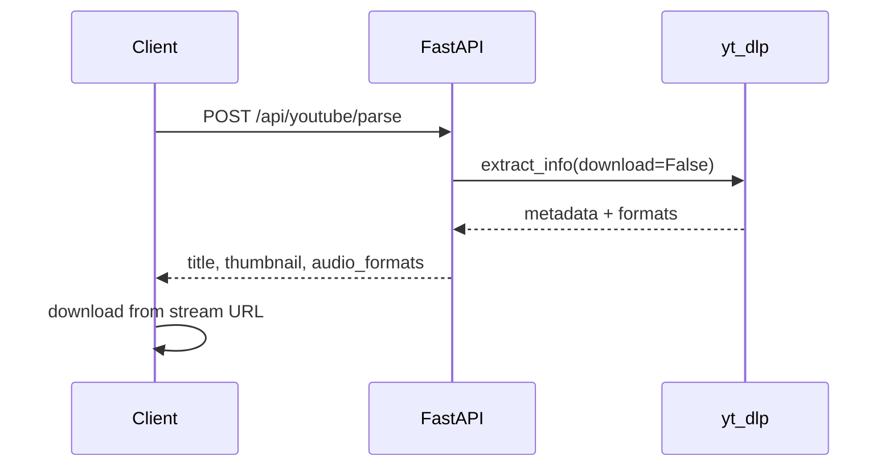

# Music Player Backend

FastAPI backend that parses YouTube URLs with [yt-dlp](https://github.com/yt-dlp/yt-dlp) and returns metadata plus direct audio stream URLs. The server does **not** download or store audio files — the client downloads from the returned URLs.

## Requirements

- Python 3.10+
- Virtual environment (recommended)

Optional but recommended for reliable YouTube extraction:

```bash
pip install "yt-dlp[default]"
```

Some YouTube videos also need a JavaScript runtime such as [deno](https://deno.land).

## Setup

```bash
python -m venv venv
source venv/bin/activate   # Windows: venv\Scripts\activate
pip install -r requirements.txt
```

## Run the server

```bash
uvicorn main:app --reload
```

- API: `http://127.0.0.1:8000`
- Swagger UI: `http://127.0.0.1:8000/docs`

## API

### Health check

```http
GET /
```

Response:

```json
{ "status": "ok" }
```

### Parse YouTube URL

```http
POST /api/youtube/parse
Content-Type: application/json
```

Request body:

```json
{
  "url": "https://youtu.be/Hc-rc1-hcco"
}
```

Supported URL forms:

- `https://www.youtube.com/watch?v=...`
- `https://youtu.be/...`
- `https://music.youtube.com/watch?v=...`

Response (200):

```json
{
  "id": "Hc-rc1-hcco",
  "title": "Sauda Iss Dil Ka (From \"Sharma Ji Ki Shaadi\")",
  "uploader": "...",
  "channel": "...",
  "duration": 207.0,
  "thumbnail": "https://i.ytimg.com/vi/Hc-rc1-hcco/maxresdefault.jpg",
  "webpage_url": "https://www.youtube.com/watch?v=Hc-rc1-hcco",
  "recommended_format_id": "251",
  "audio_formats": [
    {
      "format_id": "251",
      "ext": "webm",
      "url": "https://...",
      "abr": 139.204,
      "filesize": 3606797,
      "filesize_approx": 3606780,
      "acodec": "opus",
      "protocol": "https",
      "http_headers": {
        "User-Agent": "...",
        "Accept": "...",
        "Accept-Language": "..."
      }
    }
  ]
}
```

### Error responses

| Status | When                                                               |
| ------ | ------------------------------------------------------------------ |
| `400`  | Empty URL, playlist URL, or unsupported input                      |
| `422`  | Invalid request body                                               |
| `502`  | yt-dlp extraction failed (private, geo-blocked, unavailable, etc.) |

## Usage examples

### curl

```bash
curl -X POST http://127.0.0.1:8000/api/youtube/parse \
  -H "Content-Type: application/json" \
  -d '{"url":"https://youtu.be/Hc-rc1-hcco"}'
```

Download the recommended audio stream (replace values from the API response):

```bash
curl -L \
  -H "User-Agent: <from http_headers>" \
  -H "Accept: <from http_headers>" \
  "<audio_formats[0].url>" \
  -o track.webm
```

### Expo / React Native

```typescript
import * as FileSystem from "expo-file-system";

const API_URL = "http://YOUR_SERVER_IP:8000";

async function downloadYouTubeAudio(youtubeUrl: string) {
  const parseResponse = await fetch(`${API_URL}/api/youtube/parse`, {
    method: "POST",
    headers: { "Content-Type": "application/json" },
    body: JSON.stringify({ url: youtubeUrl }),
  });

  if (!parseResponse.ok) {
    const error = await parseResponse.json();
    throw new Error(error.detail ?? "Failed to parse YouTube URL");
  }

  const data = await parseResponse.json();
  const stream = data.audio_formats.find(
    (format: { format_id: string }) =>
      format.format_id === data.recommended_format_id,
  );

  if (!stream) {
    throw new Error("No audio stream returned");
  }

  const safeTitle = data.title.replace(/[^\w.-]+/g, "_");
  const fileUri = `${FileSystem.documentDirectory}${safeTitle}.${stream.ext}`;

  const download = await FileSystem.downloadAsync(stream.url, fileUri, {
    headers: stream.http_headers,
  });

  return {
    ...data,
    localUri: download.uri,
  };
}
```

> Use your machine's LAN IP (not `localhost`) when testing on a physical device.

## How it works

1. Client sends a single YouTube video URL to `POST /api/youtube/parse`.
2. Server runs yt-dlp with `skip_download=True` to extract metadata only.
3. Server filters audio-only formats, sorts by bitrate, and returns the top options.
4. Client downloads directly from the returned `url` using the provided `http_headers`.



## Important notes

- **Stream URLs expire.** YouTube signed URLs are temporary. Parse and download soon; do not cache stream URLs long-term.
- **Use `http_headers`.** Many streams fail without the `User-Agent` and related headers returned by the API.
- **Playlists are not supported** in the current MVP — send a single video URL.
- **No server-side storage.** Audio is never written to disk on the backend.
- **ffmpeg is not required** on the server because audio is not merged or transcoded server-side.

## Project structure

```
main.py                  # FastAPI app entrypoint
routers/youtube.py       # /api/youtube/parse route
services/youtube_parser.py  # yt-dlp extraction logic
schemas/youtube.py       # Pydantic request/response models
requirements.txt
```

## Verified example

This URL was tested successfully:

- Parse: `https://youtu.be/Hc-rc1-hcco`
- Title: _Sauda Iss Dil Ka (From "Sharma Ji Ki Shaadi")_
- Recommended format: `251` (webm/opus)
- Direct stream download: works with returned `http_headers`
